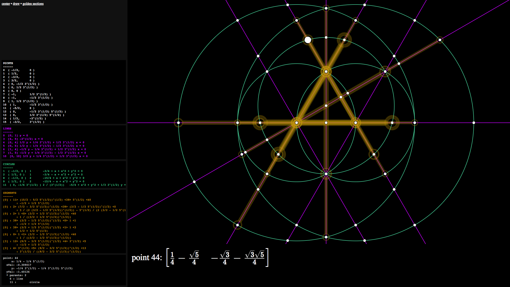

**GEOMETOR Explorer** is an essential tool of the GEOMETOR Project. You can learn more about our collaborative research project on [geometor.com](http://geometor.com)

The purpose of **Explorer** is to find and catalogue unique instances of golden sections within geometric constructions with algebraic proofs.

**Explorer** is currently a demonstration prototype. There are significant plans for enabling user interactivity including adding lines and circles within the interface, as well as analysis of the discovered golden sections.

check out **Explorer** here:

- [default - 4 circles](http://geometor.com/explorer/)

these two can take up to a few minutes to load

- [root 3 example](http://geometor.com/explorer/root3.html)
- [root 5 example](http://geometor.com/explorer/root5,html)

only tested with Chrome and Firefox - Chrome is significantly faster than Firefox.



## classical constructive geometry

**Explorer** operates under the rules of classical constructive geometry within a planar field. Explorer provides two virtual tools for constructions - an unmarked straight edge and a compass. Both of these tools require two points to operate. We align the straightedge with two points to make a line. We align the compass with two points to draw a circle. This simple framework for the study of geometric proportions has been with us since the ancients and is the foundation of Euclid's Elements.

Every geometric construction within **Explorer** begins with a blank slate. The only "givens" are the first two **starting points** on our field. Everything else must be constructed.

The distance between these two starting points represents the unit measure of the field - a distance of one. All other constructions are expressed in proportion to this unit.

The intersections of lines and circles identify new points on the field - creating opportunities for more lines and circles - and of course, more intersection points.

Line **segments** and circular **sectors** and **arcs** are used within **Explorer** as graphical illustrations and are not used directly in constructions.

Lines and circles are proportions that extend from their initial points without end. Therefore, lines are always extended beyond the screen and circles are always drawn in full. By expressing the elements fully, we allow for more discovery of relationships and intersections.

## cartesian grid and algebra

While following the formality of Euclid's constructive geometry, **Explorer** incorporates two concepts that were undeveloped in Euclid's time: the cartesian grid and algebra.

With our unit measure established by the starting points and a notion of perpendicularity, we establish a horizontal (x) and vertical (y) scale. We use these scales to identify the position of points as `[x y]`.

The origin is the point half-way between the starting points. In the cartesian plane this is `[0 0]`.

As our givens, the starting points are the only points without parents and are placed on the field with positions of `[1/2 0]` and `[-1/2 0]`

All other points are derived algebraically from the intersection of elements.

> Decimal equivalents are for applied mathematics. All calculations within **Explorer** are algebraic.


# How **Explorer** works

Constructions within **Explorer** are currently scripted. Lines and Circles are created by passing Point references as parameters.

Explorer maintains an array of constructed points and elements.

Here is the script that constructs the current geometry at index.html.

```js

//initial points set by X Y
Point( "-1/2", "0" );
Point( "1/2", "0" );

//baseline
Line( points[0], points[1] );

// vesica pisces
Circle( points[0], points[1] );
Circle( points[1], points[0] );

// //bisector
Line( points[4], points[5] );

// unit 2 circles from starting points
Circle( points[0], points[3] );
Circle( points[1], points[2] );

```

**Explorer** uses SVG for rendering the construction with the [SVG.js](http://svgjs.com/) library. It also includes the panzoom plugin for moving around the construction.

Elements and points are listed in the Side panel.

Each element is added to a [GSAP](https://greensock.com/) animation timeline. The timeline plays after the construction script is completed.

The "draw" link on the menu bar will replay the animation.

When you hover over an element or point in the drawing, its details are presented in the side panels.

There is extensive logging to the javascript console during the construction - so I highly recommend reviewing the output there.

## golden sections

Explorer examines the points on each line for golden sections. The participating segments are highlighted in the construction.

The "Animate Segments" link on menu bar will cycle through each pair of golden section segments highlighting the segments along with the parent elements necessary to construct the segments.

## ancestors

Every point in the field is fully traceable - both algebraically and geometrically - back to the starting points.

## algebra

Explorer uses the amazing javascript algebra library, [Algebrite](http://algebrite.org/), to handle the calculations under the construction.

Katex is used to render the algebraic expressions.


## The future...

- deep automated recursion to explore the geometric field
- analysis of golden section instances to look for patterns

# The GEOMETOR Project

The GEOMETOR Project is a collaborative effort to explore the architecture of all that is.

Whether we look at the architecture of nature (matter) or the architecture of logic (mind) - a resonance emerges in the form of a simple proportion. Great philosophers and scientists throughout history, when encountering this proportion and its many attributes, felt a reverence - giving it names like the "Golden Ratio" and the "Divine Proportion."

The GEOMETOR Project is an effort to document the fascinating attributes of the Golden Ratio and to seek a deeper understanding of its pervasive beauty.

more to come...
